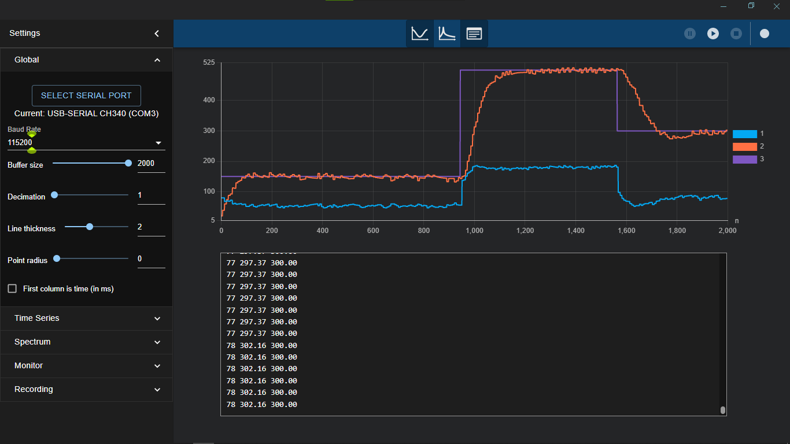
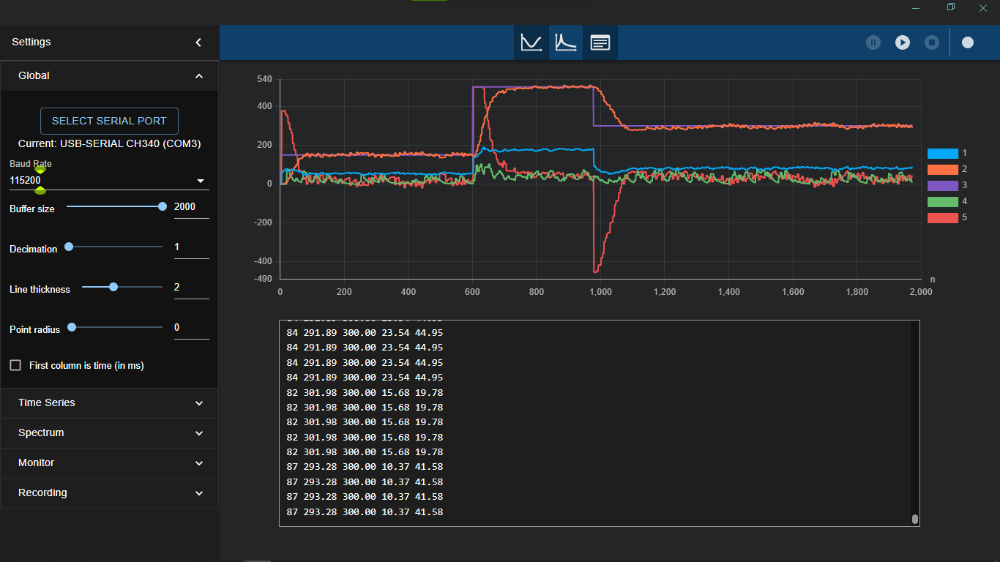
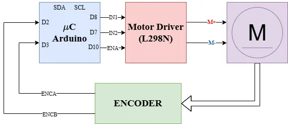
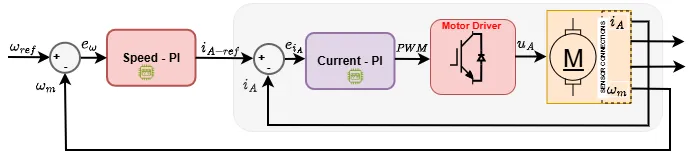

# DCMotorCascadedSpeedControlPI

This project implements a cascaded proportional-integral (PI) control system for a DC motor. The outer loop controls the motor speed, while the inner loop regulates the motor current.

## Features
- **Cascaded Control:** Implements a cascaded PI control system with separate loops for speed and current control.
- **Speed Estimation:** Uses the `SpeedEstimator_dff` library to calculate motor speed in RPM from encoder pulse data.
- **Current Measurement:** Utilizes the `INA219` library for accurate current sensing.
- **Signal Filtering:** Filters raw speed and current data using the `DigitalFilter_dff` library with an EWMA low-pass filter.
- **Motor Control:** Controls the motor's PWM signal using the `DCMotorDriver_dff` library.
- **Modular Design:** Includes reusable libraries for speed estimation, signal filtering, motor control, and current sensing.

## Project Structure
```
DCMotorCascadedSpeedControlPI/
├── include/                # Header files
├── lib/                    # Libraries
│   ├── DCMotorDriver_dff/  # Motor driver library
│   ├── DigitalFilter_dff/  # Signal filtering library
│   ├── PID_lib_dff/        # PI controller library
│   ├── SpeedEstimator_dff/ # Speed estimation library
│   └── INA219/             # Current sensing library
├── src/                    # Source files
│   └── main.cpp            # Main application logic
├── test/                   # Unit tests
├── platformio.ini          # PlatformIO configuration file
└── README.md               # Project documentation
```

## Dependencies
- [PlatformIO](https://platformio.org/) or [Arduino IDE](https://www.arduino.cc/): Used for building and uploading the project.
- Arduino Framework: Provides the base for the project.
- [SpeedEstimator_dff](https://github.com/bulb-light/SpeedEstimator_dff): For speed estimation.
- [DigitalFilter_dff](https://github.com/bulb-light/DigitalFilter_dff): For signal filtering.
- [DCMotorDriver_dff](https://github.com/bulb-light/DCMotorDriver_dff): For DC motor control.
- [PID_lib_dff](https://github.com/bulb-light/PID_lib_dff): For PI control.
- [INA219](https://github.com/RobTillaart/INA219): For current sensing.

## Getting Started

### Prerequisites
- A compatible IDE that supports the Arduino framework, preferably [PlatformIO](https://platformio.org/).
- A compatible microcontroller (e.g., Arduino Uno, ESP32).
- DC Motor with an encoder for speed measurement.
- DC Motor Driver (e.g., L298N).
- INA219 sensor for DC current measurement
- Resistors and other basic electronic components.

### Installation
1. Clone this repository:
   ```bash
   git clone --recursive https://github.com/bulb-light/ArduinoProjects_dff.git
   ```
   If you have already cloned the project without the `--recursive` option, run these commands from the project root:
   ```bash
   git submodule init
   git submodule update --recursive
   ```
   This will fetch and checkout the required submodule content.

2. Navigate to the project directory:
   ```bash
   cd ArduinoProjects_dff/DCMotorCascadedSpeedControlPI
   ```

3. Open the project in your preferred IDE (e.g., VS Code with the PlatformIO extension).

### Build and Upload
1. Connect your microcontroller to your computer.
2. Build and upload the project:
   ```bash
   platformio run --target upload
   ```
   If using the VS Code PlatformIO extension, use the Upload action in the PlatformIO toolbar.

## Usage
- The project uses the `SpeedEstimator_dff`, `INA219` and `DigitalFilter_dff` libraries to estimate motor speed in RPM, measure motor current in mA, and filter the resulting data.
- The cascaded PI controller adjusts the motor's PWM signal to maintain the desired speed and regulate current.
- Filtered speed, current data, and control signals are printed to the serial monitor for debugging and analysis.

The result of the implemented cascaded PI controller is shown in the figure below, where the purple line represents the reference speed in RPM, the red line represents the actual speed, and the blue line represents the PWM control signal:

<p align="center">
   
</p>

The figure below shows the behaivor of all the variables: the purple line represents the reference speed in RPM, the red line the actual speed, the blue line the PWM control signal, the green line the actual motor current, and the dark red line the reference current.

<p align="center">
   
</p>

### Block diagram

Refer to the following diagram for the wiring connections:

<p align="center">
   
</p>

### PI control scheme

The control architecture of a cascaded PI control system for DC motor speed regulation is shown below:

<p align="center">
   
</p>

## Contributing
Contributions are welcome! Feel free to open issues or submit pull requests.

## License
This project is licensed under the MIT License. See the [LICENSE](LICENSE) file for details.

## Acknowledgments
- [bulb-light](https://github.com/bulb-light) for the modular library design.
- [Rob Tillaart](https://github.com/RobTillaart) for the [INA219](https://github.com/RobTillaart/INA219) library.
- The open-source community for providing the tools and libraries used in this project.