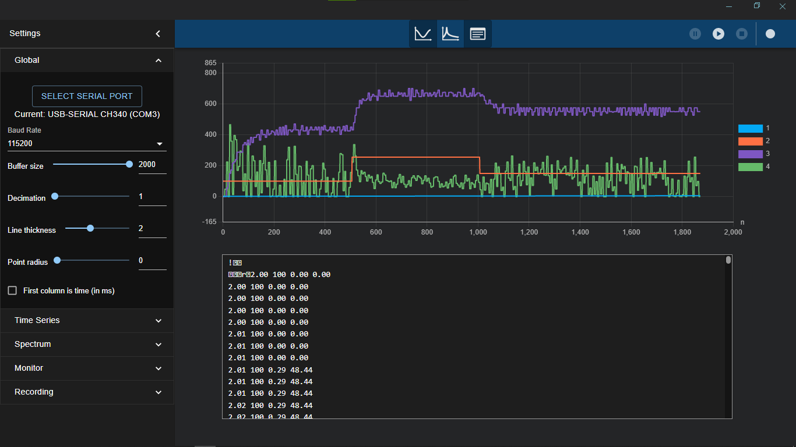
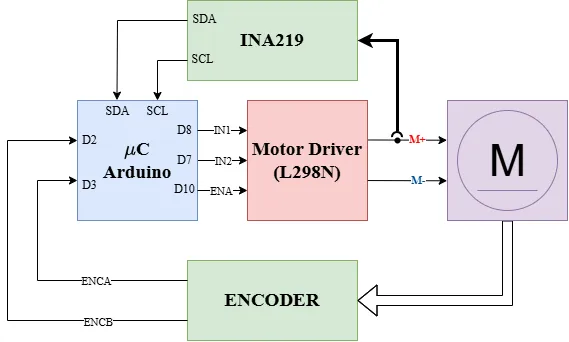

# DCMotorSpeedCurrentReading

## Overview
This project leverages the [SpeedEstimator_dff](https://github.com/bulb-light/SpeedEstimator_dff) and [INA219](https://github.com/RobTillaart/INA219) libraries to read the speed of a DC motor using magnetic encoder pulse data, as well as the current consumption via the INA219 sensor.

## Features
- **[SpeedEstimator_dff](https://github.com/bulb-light/SpeedEstimator_dff)**: This lib calculates motor speed in RPM using encoder pulse data.
- **Current Measurement**: Reads motor current using the [INA219](https://github.com/RobTillaart/INA219) sensor.
- **Modular Design**: Includes reusable libraries for speed estimation, current sensing, and motor control.

## Project Structure
```
DCMotorSpeedCurrentReading/
├── include/                # Header files
├── lib/                    # Libraries
│   ├── DCMotorDriver_dff/  # Motor driver library
│   ├── INA219/             # INA219 current sensor library
│   └── SpeedEstimator_dff/ # Speed estimation library
├── src/                    # Source files
│   └── main.cpp            # Main application logic
├── test/                   # Unit tests
├── platformio.ini          # PlatformIO configuration file
└── README.md               # Project documentation
```

## Dependencies
- **[PlatformIO](https://platformio.org/)** or **[Arduino IDE](https://www.arduino.cc/)**: Used for building and uploading the project.
- **Arduino Framework**: Provides the base for the project.
- **[INA219](https://github.com/RobTillaart/INA219) Library**: For current sensing.
- **[SpeedEstimator_dff](https://github.com/bulb-light/SpeedEstimator_dff) Library**: For speed reading.

## Getting Started
### Prerequisites
- A compatible IDE that supports the Arduino framework, preferably [PlatformIO](https://platformio.org/).
- Ensure you have a compatible microcontroller (e.g., Arduino Uno, ESP32).

### Installation
1. Clone this repository along with the linked submodules:
   ```bash
   git clone --recursive https://github.com/bulb-light/ArduinoProjects_dff.git
   ```
   If you have already cloned the project without the `--recursive` option, run these commands from the project root:
   ```bash
   git submodule init
   git submodule update --recursive
   ```
   This will fetch and checkout the required submodule content.
2. Navigate to the project directory:
   ```bash
   cd ArduinoProjects_dff/DCMotorSpeedCurrentReading
   ```
3. Open the project in your preferred IDE (e.g., VS Code with PlatformIO extension).

### Build and Upload
1. Connect your microcontroller to your computer.
2. Build and upload the project:
   ```bash
   platformio run --target upload
   ```
   Run this command from the project root when using the PlatformIO CLI; if you're using the VS Code PlatformIO extension, use the **Upload** action in the PlatformIO toolbar instead.

## Usage
- The project reads encoder pulses and calculates motor speed in RPM.
- It also measures the motor's current using the INA219 sensor.
- The results are printed to the serial monitor.

The project result is shown below.

<p align="center">
   
</p>

### Block diagram
Refer to the following diagram for the wiring connections:

<p align="center">
   
</p>

## Contributing
Contributions are welcome! Feel free to open issues or submit pull requests.

## License
This project is licensed under the MIT License. See the [LICENSE](LICENSE) file for details.

## Acknowledgments
- [bulb-light](https://github.com/bulb-light) for the modular library design.
- [Curio Res](https://curiores.com) for the free and open source Serial Analyzer tool. Visit her [Github page](https://github.com/curiores).
- [Rob Tillaart](https://github.com/RobTillaart) for the [INA219](https://github.com/RobTillaart/INA219) library.
- The open-source community for providing the tools and libraries used in this project.