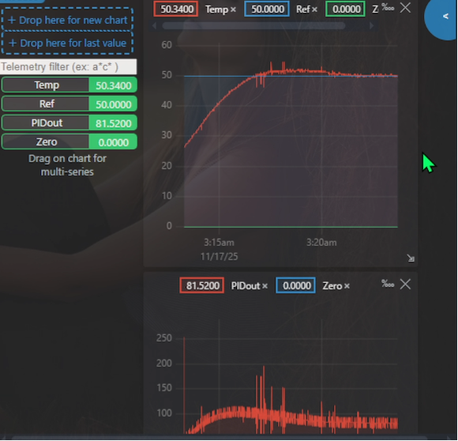
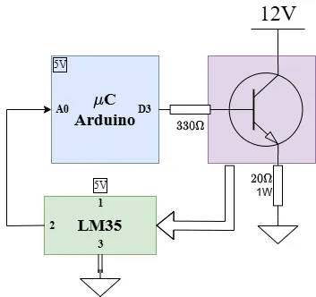

# Temperature Control System

## Overview
This project implements a digital PID controller for a thermal process using an Arduino Nano and an LM35 temperature sensor. The system reads the temperature, computes the PID output, and adjusts a heating element accordingly.

## Features
- **PID Library**: A reusable and configurable PID controller implementation.
- **Temperature Control**: Reads temperature from an LM35 sensor and adjusts a heating element using a TIP31C transistor.
- **Arduino Integration**: Designed to run on Arduino and ESP32 boards.
- **Real-Time Monitoring**: Outputs temperature, setpoint, and PID values via serial communication.

## Project Structure
```
TemperatureControlLM35/
├── LICENSE
├── README.md
├── include/
├── lib/
│   └── PID/
│       ├── PID.cpp
│       ├── PID.h
│       └── README.md
├── src/
│   └── main.cpp
└── test/
```

## Getting Started
### Prerequisites
- Arduino IDE or PlatformIO
- Arduino, ESP32 or compatible board
- LM35 temperature sensor
- TIP31C transistor
- Resistors and other basic electronic components

### Installation/Usage
1. Clone this repository (it depens on [PID_lib_dff](https://github.com/bulb-light/PID_lib_dff.git)):
   ```bash
   git clone --recursive https://github.com/bulb-light/ArduinoProjects_dff.git
   ```
   If you have already cloned the project without `--recursive`, run these commands from the project root:
   ```bash
   git submodule init
   git submodule update --recursive
   ```
   This will fetch and checkout the required submodule content.
3. Open the project in your preferred IDE.
4. Upload the `src/main.cpp` file to your Arduino board.

## Usage
1. Connect the LM35 sensor to the analog pin `A0` and the TIP31C transistor to the PWM pin `D3`.
2. Adjust the setpoint temperature in the `main.cpp` file.
3. Monitor the serial output for real-time temperature and PID values.

The project result is shown below.

<p align="center">
   
</p>

### Block diagram
Refer to the following diagram for the wiring connections:

<p align="center">
   
</p>

## License
This project is licensed under the MIT License. See the [LICENSE](./LICENSE) file for details.

## Author
David Chirme Sisa ([GitHub](https://github.com/bulb-light))

## Acknowledgments
- Elemsys https://github.com/elemsys
- Arduino community for their extensive documentation and examples.
- Inspiration for the PID library from control systems theory.
